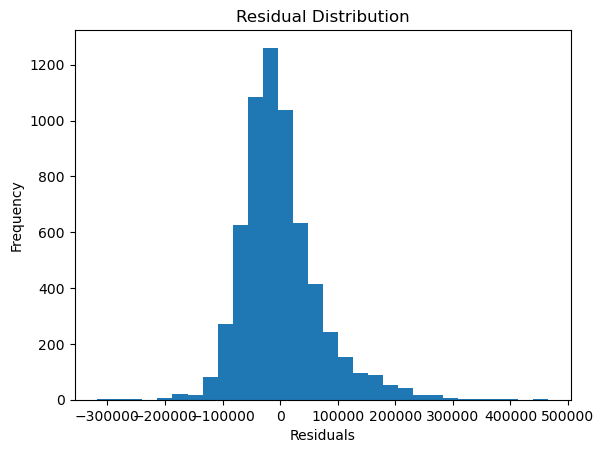

# 📈 Ridge Regression on Housing Dataset


## 🔹 Project Overview
This project implements **Ridge Regression** using scikit-learn to predict house prices from a housing dataset.
Ridge Regression is a regularized version of Linear Regression that helps reduce overfitting by penalizing
large coefficients.

The notebook demonstrates the complete machine learning workflow, including data loading, preprocessing,
model training, evaluation, and residual analysis.

---

## 📂 Repository Contents
Ridge_Regression  
│  
├── Ridge_Regression.ipynb  
├── housing.csv  
├── residual_distribution.png  
└── README.md  

---

## 📊 Dataset
- **File:** housing.csv  
- **Type:** Tabular housing data  
- **Purpose:** Used to train and evaluate a Ridge Regression model for house price prediction  

---

## 🛠️ Libraries & Tools Used
- Python  
- NumPy  
- Pandas  
- Matplotlib  
- scikit-learn  

---

## ⚙️ Project Workflow
1. Load the housing dataset  
2. Perform train-test split  
3. Train a Ridge Regression model  
4. Predict house prices on test data  
5. Evaluate model performance using R² Score  
6. Analyze residual distribution  

---

## 📈 Model Evaluation

**R² Score:** 0.6397684336089735  

**Interpretation:**  
The model explains approximately **64% of the variance** in housing prices.
Ridge regularization helps control model complexity while maintaining performance
comparable to standard linear regression.

---

## 📉 Residual Analysis

**Residual Distribution (y_test − ridge_pred):**



### Key Insights
- Residuals are approximately normally distributed  
- Indicates that regression assumptions are largely satisfied  
- Regularization improves model stability  

---

## 📌 Key Observations
- Ridge Regression provides a more stable alternative to Linear Regression  
- Regularization helps reduce overfitting  
- Performance remains strong while controlling coefficient magnitude  

---

## ▶️ How to Run the Project
1. Clone the repository  
```
git clone https://github.com/your-username/Ridge_Regression.git  
```
2. Install required libraries
```
pip install numpy pandas matplotlib scikit-learn  
```
3. Open `Ridge_Regression.ipynb`  
4. Run all cells sequentially  

---

## 🚀 Future Enhancements
- Compare Ridge vs Lasso vs ElasticNet  
- Tune the alpha hyperparameter using cross-validation  
- Add RMSE and MAE evaluation metrics

---
